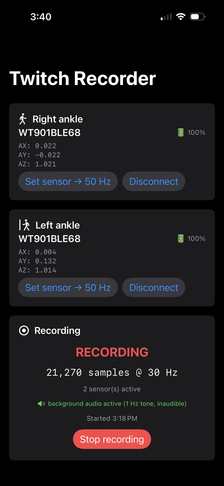
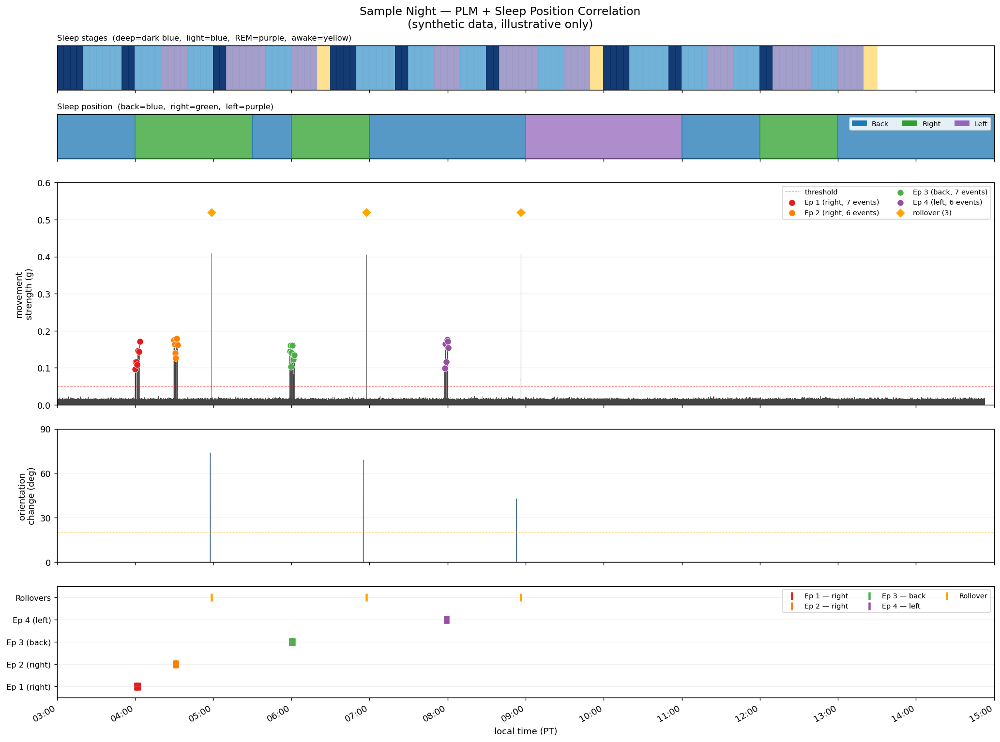

# Twitch Recorder

An iOS app + Python analysis pipeline for overnight **Periodic Limb Movement (PLM)** detection.
Streams accelerometer data from one or two [WitMotion WT901BLECL](https://www.wit-motion.com) ankle sensors to a CSV, then runs signal processing to classify movements, detect PLM series, and correlate with Oura ring sleep stages.

---

## Hardware

| Device | Role |
|---|---|
| WitMotion WT901BLECL (×2) | Ankle accelerometers (right + left) |
| iPhone (nightstand) | Recording host — iOS app |
| Oura Ring | Sleep stage ground truth (via API) |

---

## iOS App — `BleExample/BleExampleApp.swift`

Single-screen SwiftUI app that:

- Connects up to **2 WitMotion sensors** over BLE (right ankle / left ankle)
- Records at **30 Hz** to a timestamped CSV in the app's Documents folder
- Runs a **position-calibration wizard** at the start of each night (back / right side / left side)
- Keeps iOS alive overnight using a **silent 1 Hz audio loop** + background task renewal
- Exports the CSV via the system share sheet

### App screenshot



---

## Analysis Pipeline — `analysis/analyze_night.py`

```
python analyze_night.py path/to/twitch_YYYYMMDD_HHMMSS.csv [--calibration path.json]
```

**Outputs** (written alongside the input CSV):

| File | Contents |
|---|---|
| `*_events.csv` | One row per detected movement event |
| `*_overview.png` | Full-night plot (hypnogram + envelope + events) |
| `*_annotated.png` | Detailed annotated timeline with all panels |
| `*_summary.txt` | Counts by class and sleep stage |

### Detection pipeline

1. Load 30 Hz accel CSV, drop duplicate-timestamp rows
2. Compute `|a| − 1 g` (gravity-removed magnitude)
3. Bandpass 0.5–10 Hz (Butterworth, zero-phase)
4. Envelope: rectify → 200 ms moving average
5. Threshold with hysteresis: T_on = 0.05 g, T_off = 0.02 g
6. Duration gate → classify as `movement` / `rollover` / `out_of_bed`
7. Tilt detector (gravity-vector low-pass) reclassifies rollovers
8. Kick detector: high-peak + brief + no tilt → `kick`
9. PLM series scoring: ≥4 events with 5–90 s gaps **during sleep** → `PLM_in_series`
10. Join with Oura `sleep_phase_5_min` to tag each event with its sleep stage
11. Dual-ankle: score both legs independently, detect bilateral events

### Sample output



*Synthetic data — illustrative only.*

Panels top to bottom:
- **Sleep stages** from Oura (dark blue = deep, blue = light, purple = REM, yellow = awake)
- **Movement strength (g)** — accel envelope with PLM episode markers (colored by episode) and rollover markers
- **Orientation change (°)** — tilt-based rollover detector
- **Event timeline** — each PLM event and rollover as a vertical tick mark

---

## Position calibration — `analysis/calibrate_position.py`

The app runs a ~33 s wizard at recording start (back → right side → left side). Run this script on the same CSV to extract gravity-vector centroids for each position. The resulting `calibration.json` is auto-detected by `analyze_night.py`.

```
python calibrate_position.py path/to/twitch_YYYYMMDD_HHMMSS.csv
```

---

## Setup

### Python dependencies

```bash
pip install numpy pandas scipy matplotlib requests python-dotenv
```

### Oura API token

Create a [Personal Access Token](https://cloud.ouraring.com/personal-access-tokens) and add it to `analysis/.env`:

```
OURA_PAT=your_token_here
```

The `.env` file is gitignored — never commit it.

---

## CSV format

```
timestamp_iso, ankleR_acc_x_g, ..._y_g, ..._z_g, ankleR_gyro_x_dps, ..._y_dps, ..._z_dps,
               ankleL_acc_x_g, ..._y_g, ..._z_g, ankleL_gyro_x_dps, ..._y_dps, ..._z_dps,
               hr_bpm, rr_interval_ms
```

30 Hz × ~8 h ≈ 864,000 rows (~60 MB uncompressed).

---

## Privacy

Raw overnight CSVs contain personal health data and are gitignored. Only synthetic sample images are committed to this repo.
